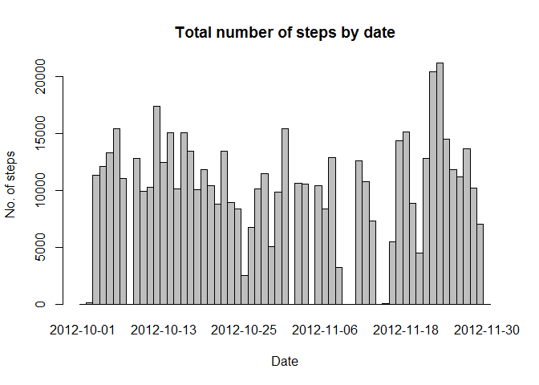
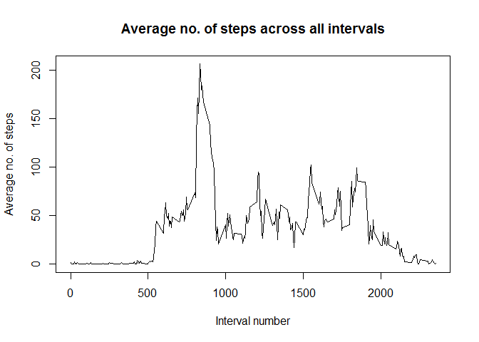
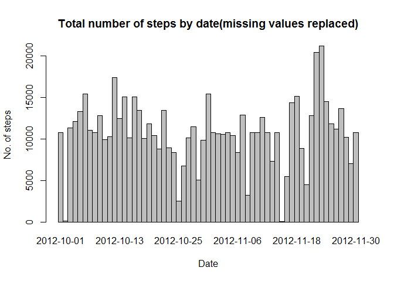
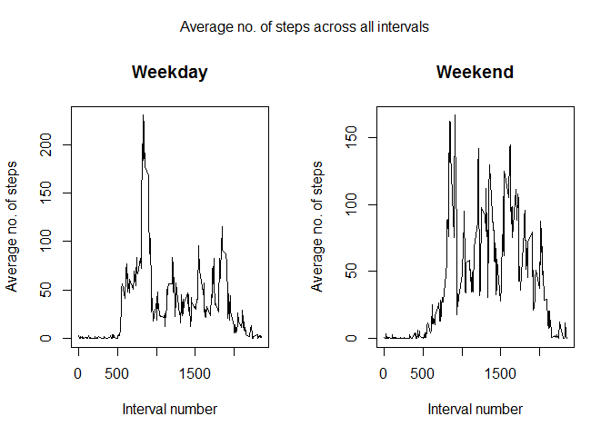

# Reproducible Research: Peer Assessment 1


# Reproducible Research - Course Project 1

##Load the data

```r
data6 <- read.csv("activity.csv")
```

##Mean of total number of steps taken per day

```r
no.steps <- tapply(data6$steps, data6$date, function(v)sum(v, na.rm = TRUE))
barplot(no.steps, space = 0, xlab = "Date", ylab = "No. of steps", 
        main = "Total number of steps by date")
```

<!-- -->

```r
y <- mean(no.steps)
z <- median(no.steps)
```
**9354.2295082** is the Mean and **10395** is the Median number of steps taken each day 

##Average daily activity pattern

```r
avg.interval <- tapply(data6$steps, data6$interval, function(v)mean(v, na.rm = TRUE))
plot(dimnames(avg.interval)[[1]], avg.interval, type = "l", xlab = "Interval number", 
     ylab = "Average no. of steps", main = "Average no. of steps across all intervals" )
```

<!-- -->

```r
interval_name <- names(which.max(avg.interval))
```
**835** is the 5-minute interval that, on average, contains the maximum number of steps

##Input missing values
We will replace any missing value by the mean of that 5-minute interval. First we create a logical vector *x* which is TRUE at indices where there are missing values. Then we create a new integer vector *newsteps* which is identical to *steps* vector in the original dataframe. Then we replace NAs in *newsteps*(identified by logical vector *x*) by values from *avg.interval* which contains average values for intervals across all days. 


```r
no.NAs <- sum(is.na(data6$steps))

##the three steps below replace NAs as described above
x <- is.na(data6$steps)
newsteps <- data6$steps
newsteps[x] <- (rep(avg.interval, 61))[x]

newdataset <- data.frame(newsteps = newsteps, date = data6$date, interval = data6$interval)

steps_by_Date <- tapply(newdataset$newsteps, newdataset$date, sum)
barplot(steps_by_Date, space = 0, xlab = "Date", ylab = "No. of steps", 
        main = "Total number of steps by date(missing values replaced)")
```

<!-- -->

```r
a <- mean(steps_by_Date)
b <- median(steps_by_Date)
```

The total number of missing values is **2304**.   
**AFTER** replacing missing values,  **1.0766189\times 10^{4}** is the Mean and **1.0766189\times 10^{4}** is the Median number of steps taken each day. These values show some increase from those previously calculated.  
The total daily number of steps only change for the eight days that had missing values, replaced by mean number of steps taken each day.

##Activity Patterns - Weekdays and Weekends

```r
newdataset$day <- weekdays(as.Date(newdataset$date))
newdataset$day[newdataset$day == "Saturday" | newdataset$day == "Sunday"] <- "weekend"
newdataset$day[newdataset$day != "weekend"] <- "weekday"

weekday_data <- subset(newdataset, newdataset$day %in% "weekday")
weekend_data <- subset(newdataset, newdataset$day %in% "weekend")

avg.interval1 <- tapply(weekday_data$newsteps, weekday_data$interval, mean)
avg.interval2 <- tapply(weekend_data$newsteps, weekend_data$interval, mean)

par(mfrow = c(1,2), oma = c(0,0,2,0))
plot(dimnames(avg.interval1)[[1]], avg.interval1, type = "l", xlab = "Interval number", 
     ylab = "Average no. of steps", main = "Weekday" )
plot(dimnames(avg.interval2)[[1]], avg.interval2, type = "l", xlab = "Interval number", 
     ylab = "Average no. of steps", main = "Weekend" )
mtext("Average no. of steps across all intervals", outer = TRUE)
```

<!-- -->

```r
par(mfrow = c(1,1), oma = c(0,0,0,0))
```

